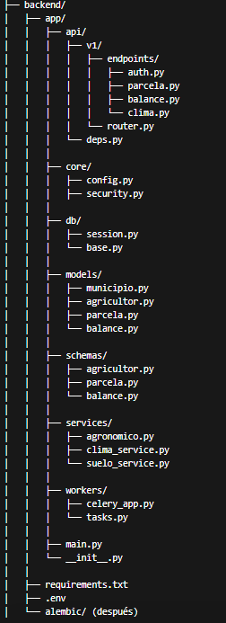

# AguaSabia — Sistema de Gestión Hídrica para Municipios



**AguaSabia** es un sistema web de gestión hídrica diseñado para municipios, enfocado en el cálculo de balance hídrico y evapotranspiración para la Agricultura Familiar Campesina (AFC). Este sistema permite optimizar el uso del agua de riego mediante el procesamiento inteligente de datos climáticos y de suelo públicos, reduciendo costos energéticos y conservando los recursos hídricos locales.

El sistema cuenta con un backend robusto basado en **FastAPI** que implementa el motor de balance según el estándar FAO-56, gestiona colas de tareas asíncronas para el envío de notificaciones por WhatsApp y almacena datos históricos de parcelas y balances.

---

## Stack Tecnológico

- **FastAPI**: Framework web asíncrono de alto rendimiento para Python.
- **SQLAlchemy 2.0**: ORM de Python para mapeo de entidades de base de datos.
- **Alembic**: Herramienta de control de versiones y migraciones de esquemas SQL.
- **PostgreSQL**: Base de datos relacional para persistencia de datos (agricultores, parcelas, comunas, regiones y balances).
- **Redis**: Sistema de caché en memoria y message broker de tareas.
- **Celery**: Gestor de colas de tareas en segundo plano para procesos masivos o calendarizados.

---

## Estructura de Documentación

Toda la documentación del proyecto se encuentra consolidada y sincronizada bajo el directorio [Documentacion](Documentacion):

- **Guías de Configuración e Instalación**:
  - [Configuración del Backend](Documentacion/docs_tecnicos/backend-setup.md): Instrucciones completas para levantar el backend localmente y ejecutar las migraciones iniciales.
  - [Entorno de Pruebas](Documentacion/Entono%20de%20pruebas/testing-environment.md): Cómo instalar PostgreSQL y Redis localmente en Windows, macOS o Linux.
  - [Variables de Entorno (.env)](Documentacion/docs_tecnicos/configuracion_entorno.md): Explicación detallada de cada parámetro de configuración del sistema.

- **Diseño del Sistema y Arquitectura**:
  - [Estructura del Proyecto](Documentacion/Estructura%20del%20proyecto/project-structure.md): Árbol de carpetas real y flujo de datos por capas.
  - [Documentación de Base de Datos](Documentacion/docs_tecnicos/database-documentation.md): Diagrama lógico, tablas, campos y relaciones de PostgreSQL.
  - [Documentación de API REST](Documentacion/Documentacion%20de%20api/api-documentation.md): Catálogo de endpoints HTTP, parámetros requeridos y ejemplos de payloads.
  - [Manejo de Errores](Documentacion/docs_tecnicos/error-handling.md): Códigos HTTP y control de excepciones.

- **Mantenimiento y Publicación**:
  - [Despliegue en Railway](Documentacion/docs_tecnicos/despliegue_railway.md): Guía paso a paso para desplegar API, bases de datos y workers a producción.
  - [Backup y Restauración](Documentacion/docs_tecnicos/backup-and-restore.md): Procedimientos rutinarios y de emergencia para respaldar PostgreSQL.
  - [Matriz de Trazabilidad](Documentacion/Matriz%20de%20trazabilidad/traceability-matrix.md): Mapeo entre los requerimientos funcionales del sistema y los archivos/endpoints reales del backend.

---

## Instalación Rápida (Entorno Local)

Para iniciar el backend en tu máquina local:

### 1. Prerrequisitos
Asegúrate de tener instalados y corriendo:
- Python 3.10+
- PostgreSQL
- Redis (puerto `6379`)

### 2. Clonar y Configurar Dependencias
```bash
# Acceder a la carpeta del backend
cd Proyecto/backend

# Crear y activar entorno virtual (Windows)
python -m venv .venv
.\.venv\Scripts\activate

# Instalar dependencias
pip install -r requirements.txt
```

### 3. Variables de Entorno
Crea tu archivo `.env` basado en la plantilla de desarrollo:
```bash
# En Windows (PowerShell)
Copy-Item .env.example .env
```
Edita `.env` y configura el parámetro `DATABASE_URL` con tu usuario y contraseña locales de Postgres.

### 4. Crear Base de Datos y Migraciones
Crea una base de datos vacía llamada `aguasabia` en tu PostgreSQL. Luego, genera la migración inicial y aplícala:
```bash
# Generar script de migración por primera vez
python -m alembic revision --autogenerate -m "migracion inicial"

# Aplicar las tablas físicas a la base de datos
python -m alembic upgrade head

# Poblar con regiones y comunas iniciales chilenas
python scripts/seed.py
```

### 5. Lanzar los Servidores
**Iniciar la API (FastAPI):**
```bash
uvicorn app.main:app --reload
```
Accede a `http://localhost:8000/docs` para ver y probar la API desde la interfaz Swagger.

**Iniciar el Worker de Tareas (Celery):**
En una terminal nueva con el entorno virtual activo:
```bash
celery -A app.worker.celery_app worker --loglevel=info --pool=solo
```

---

## Próximos Pasos (Fase de Producción)
Las integraciones automáticas con **Open-Meteo API** (clima diario) e **ISRIC SoilGrids API** (datos de suelo) están diseñadas conceptualmente mediante stubs en [agronomy.py](Proyecto/backend/app/services/agronomy.py). Para completar estas implementaciones en fases futuras, revisa las fórmulas de balance especificadas en el documento de especificación técnica interna [DocumentacionPersonal.txt](DocumentacionPersonal.txt).
